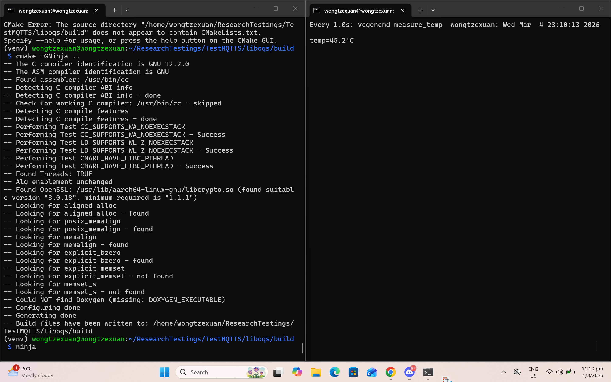
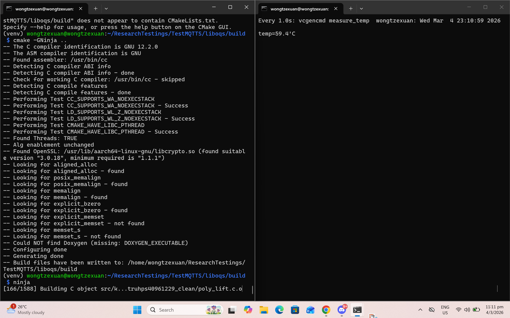
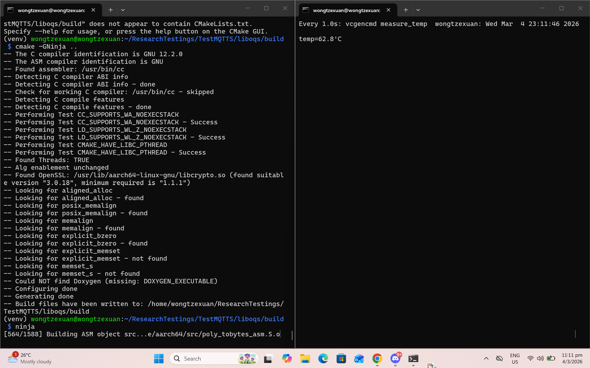
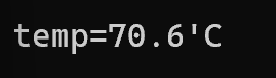
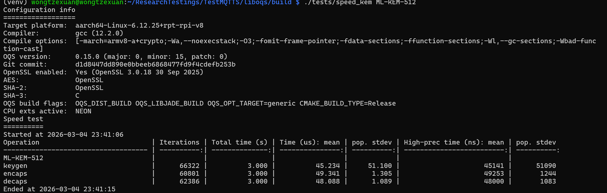

# This is a performance benchmarking test for my Pi running heavy mathematical load of ML
# Before ninja command (Compilation of Quantum Math(liboqs))

# After ninja command

# benchmarking of ML-KEM512 on Pi

# benchmarking of NIST-standardized PQC

The benchmark breaks down the process into three distinct operations that must occur for every secure MQTT session:

Keygen (Key Generation): Measures the speed at which the Gateway can create a unique quantum-resistant private/public key pair.

Encaps (Encapsulation): Measures how fast the IoT Sensor can take that public key and "lock" a secret inside a cipher-text to send back.

Decaps (Decapsulation): Measures the time the Gateway takes to use its private key to "unlock" that secret so symmetric communication can begin.

Time (us) - Mean Latency: This is the most critical number for IoT. It tells you if the quantum handshake is fast enough to happen in real-time or if it will cause a timeout in your MQTT broker.

CPU Cycles - Computational Cost: This represents the "work" the Pi's processor is doing. High cycle counts often correlate directly with the Power Consumption increase.

####

(venv) wongtzexuan@wongtzexuan:~/ResearchTestings/TestMQTTS/liboqs/build $ ./tests/speed_kem
Configuration info
==================
Target platform:  aarch64-Linux-6.12.25+rpt-rpi-v8
Compiler:         gcc (12.2.0)
Compile options:  [-march=armv8-a+crypto;-Wa,--noexecstack;-O3;-fomit-frame-pointer;-fdata-sections;-ffunction-sections;-Wl,--gc-sections;-Wbad-function-cast]
OQS version:      0.15.0 (major: 0, minor: 15, patch: 0)
Git commit:       d1d8447dd890e0bbeeb6868477fd9f4cdefb253b
OpenSSL enabled:  Yes (OpenSSL 3.0.18 30 Sep 2025)
AES:              OpenSSL
SHA-2:            OpenSSL
SHA-3:            C
OQS build flags:  OQS_DIST_BUILD OQS_LIBJADE_BUILD OQS_OPT_TARGET=generic CMAKE_BUILD_TYPE=Release
CPU exts active:  NEON
Speed test
==========
Started at 2026-03-04 23:46:26
Operation                            | Iterations | Total time (s) | Time (us): mean | pop. stdev | High-prec time (ns): mean | pop. stdev
------------------------------------ | ----------:| --------------:| ---------------:| ----------:| -------------------------:| ----------:
BIKE-L1                              |            |                |                 |            |                           |
keygen                               |         69 |          3.001 |       43490.826 |   6892.773 |                  43490694 |    6892491
encaps                               |       1339 |          3.001 |        2240.916 |      7.445 |                   2240814 |       7426
decaps                               |         86 |          3.020 |       35117.244 |     92.554 |                  35117184 |      92545
BIKE-L3                              |            |                |                 |            |                           |
keygen                               |         23 |          3.043 |      132302.957 |     59.648 |                 132302926 |      59593
encaps                               |        437 |          3.003 |        6870.886 |     36.169 |                   6870790 |      36174
decaps                               |         28 |          3.094 |      110494.893 |    118.344 |                 110494738 |     118098
BIKE-L5                              |            |                |                 |            |                           |
keygen                               |         10 |          3.312 |      331213.500 |    225.439 |                 331213235 |     225444
encaps                               |        175 |          3.014 |       17223.023 |     27.414 |                  17222906 |      27434
decaps                               |         11 |          3.065 |      278648.091 |    123.007 |                 278647855 |     122908
Classic-McEliece-348864              |            |                |                 |            |                           |
keygen                               |         10 |          3.471 |      347054.300 | 197064.187 |                 347054080 |  197064157
encaps                               |      16510 |          3.000 |         181.708 |     21.787 |                    181623 |      21788
decaps                               |         55 |          3.048 |       55422.600 |     73.733 |                  55422427 |      73661
Classic-McEliece-348864f             |            |                |                 |            |                           |
keygen                               |         20 |          3.030 |      151511.200 |    360.719 |                 151511091 |     360842
encaps                               |      16546 |          3.000 |         181.315 |     20.852 |                    181225 |      20855
decaps                               |         55 |          3.047 |       55397.127 |     27.384 |                  55397050 |      27381
Classic-McEliece-460896              |            |                |                 |            |                           |
keygen                               |          3 |          3.003 |     1000876.333 | 361672.735 |                1000876459 |  361673015
encaps                               |       7831 |          3.000 |         383.118 |     65.340 |                    383029 |      65337
decaps                               |         34 |          3.036 |       89285.412 |     35.375 |                  89285376 |      35362
Classic-McEliece-460896f             |            |                |                 |            |                           |
keygen                               |          6 |          3.099 |      516465.167 |   6829.890 |                 516464939 |    6830004
encaps                               |       7833 |          3.000 |         383.037 |     65.898 |                    382951 |      65899
decaps                               |         34 |          3.036 |       89284.235 |     31.011 |                  89284156 |      31125
Classic-McEliece-6688128             |            |                |                 |            |                           |
keygen                               |          1 |          7.290 |     7289609.000 |      0.000 |                7289608960 |          0
encaps                               |       4145 |          3.000 |         723.868 |    119.806 |                    723770 |     119790
decaps                               |         18 |          3.076 |      170874.278 |     81.079 |                 170874169 |      80931
Classic-McEliece-6688128f            |            |                |                 |            |                           |
keygen                               |          2 |          5.103 |     2551383.500 |    699.500 |                2551383168 |     699264
encaps                               |       4133 |          3.000 |         725.915 |    124.363 |                    725798 |     124354
decaps                               |         18 |          3.075 |      170852.889 |     33.972 |                 170852736 |      33902
Classic-McEliece-6960119             |            |                |                 |            |                           |
keygen                               |          1 |         12.748 |    12748133.000 |      0.000 |               12748133120 |          0
encaps                               |       1791 |          3.001 |        1675.858 |     82.307 |                   1675701 |      82301
decaps                               |         19 |          3.144 |      165454.684 |     45.775 |                 165454619 |      45753
Classic-McEliece-6960119f            |            |                |                 |            |                           |
keygen                               |          2 |          4.602 |     2301207.000 |   1445.000 |                2301207040 |    1444864
encaps                               |       1786 |          3.001 |        1680.490 |     90.213 |                   1680352 |      90189
decaps                               |         19 |          3.144 |      165459.421 |     55.651 |                 165459173 |      55603
Classic-McEliece-8192128             |            |                |                 |            |                           |
keygen                               |          1 |          3.354 |     3353978.000 |      0.000 |                3353978368 |          0
encaps                               |       3768 |          3.000 |         796.194 |     87.910 |                    796089 |      87889
decaps                               |         15 |          3.133 |      208879.000 |     67.981 |                 208879002 |      68039
Classic-McEliece-8192128f            |            |                |                 |            |                           |
keygen                               |          1 |          3.385 |     3385450.000 |      0.000 |                3385449472 |          0
encaps                               |       3796 |          3.000 |         790.347 |     83.011 |                    790229 |      83001
decaps                               |         15 |          3.133 |      208872.133 |     49.562 |                 208871970 |      49486
Kyber512                             |            |                |                 |            |                           |
keygen                               |      58032 |          3.000 |          51.696 |      1.549 |                     51595 |       1477
encaps                               |      54312 |          3.000 |          55.237 |      1.324 |                     55138 |       1294
decaps                               |      69789 |          3.000 |          42.987 |      1.680 |                     42888 |       1650
Kyber768                             |            |                |                 |            |                           |
keygen                               |      41219 |          3.000 |          72.782 |      1.723 |                     72694 |       1657
encaps                               |      36766 |          3.000 |          81.599 |      1.612 |                     81508 |       1544
decaps                               |      44025 |          3.000 |          68.144 |      1.431 |                     68042 |       1414
Kyber1024                            |            |                |                 |            |                           |
keygen                               |      28587 |          3.000 |         104.944 |      2.415 |                    104850 |       2372
encaps                               |      25614 |          3.000 |         117.125 |      1.918 |                    117035 |       1881
decaps                               |      29012 |          3.000 |         103.408 |      1.683 |                    103322 |       1641
ML-KEM-512                           |            |                |                 |            |                           |
keygen                               |      67744 |          3.000 |          44.285 |      1.353 |                     44199 |       1335
encaps                               |      60807 |          3.000 |          49.337 |      1.346 |                     49249 |       1287
decaps                               |      61915 |          3.000 |          48.454 |      6.765 |                     48366 |       6753
ML-KEM-768                           |            |                |                 |            |                           |
keygen                               |      44017 |          3.000 |          68.157 |      1.779 |                     68070 |       1726
encaps                               |      41268 |          3.000 |          72.697 |      1.498 |                     72609 |       1418
decaps                               |      39726 |          3.000 |          75.518 |      1.525 |                     75431 |       1453
ML-KEM-1024                          |            |                |                 |            |                           |
keygen                               |      30757 |          3.000 |          97.539 |      2.207 |                     97447 |       2168
encaps                               |      28782 |          3.000 |         104.232 |      1.700 |                    104144 |       1676
decaps                               |      26945 |          3.000 |         111.339 |      1.697 |                    111252 |       1671
NTRU-HPS-2048-509                    |            |                |                 |            |                           |
keygen                               |       1056 |          3.002 |        2842.619 |     10.125 |                   2842524 |      10117
encaps                               |      25778 |          3.000 |         116.382 |      1.731 |                    116285 |       1698
decaps                               |      24250 |          3.000 |         123.712 |      1.971 |                    123601 |       1917
NTRU-HPS-2048-677                    |            |                |                 |            |                           |
keygen                               |        596 |          3.001 |        5034.398 |     10.214 |                   5034301 |      10182
encaps                               |      17932 |          3.000 |         167.301 |      2.264 |                    167192 |       2233
decaps                               |      15402 |          3.000 |         194.786 |      2.234 |                    194693 |       2189
NTRU-HPS-4096-821                    |            |                |                 |            |                           |
keygen                               |        420 |          3.003 |        7150.612 |     17.195 |                   7150488 |      17155
encaps                               |      14245 |          3.000 |         210.613 |      2.699 |                    210504 |       2682
decaps                               |      11565 |          3.000 |         259.413 |      4.242 |                    259302 |       4229
NTRU-HPS-4096-1229                   |            |                |                 |            |                           |
keygen                               |        197 |          3.012 |       15290.178 |     26.654 |                  15290102 |      26665
encaps                               |       8601 |          3.000 |         348.811 |      3.332 |                    348728 |       3309
decaps                               |       6417 |          3.000 |         467.518 |      4.034 |                    467421 |       4005
NTRU-HRSS-701                        |            |                |                 |            |                           |
keygen                               |        583 |          3.003 |        5150.206 |     10.972 |                   5150117 |      10944
encaps                               |      30330 |          3.000 |          98.913 |      9.709 |                     98814 |       9699
decaps                               |      14540 |          3.000 |         206.340 |      2.545 |                    206230 |       2526
NTRU-HRSS-1373                       |            |                |                 |            |                           |
keygen                               |        156 |          3.005 |       19262.795 |     38.693 |                  19262727 |      38660
encaps                               |      10553 |          3.000 |         284.286 |      3.026 |                    284198 |       2999
decaps                               |       4257 |          3.001 |         704.847 |      4.946 |                    704754 |       4937
sntrup761                            |            |                |                 |            |                           |
keygen                               |        237 |          3.009 |       12694.430 |     41.753 |                  12694329 |      41742
encaps                               |       6914 |          3.000 |         433.941 |      3.415 |                    433855 |       3398
decaps                               |       3629 |          3.000 |         826.703 |      4.533 |                    826614 |       4510
FrodoKEM-640-AES                     |            |                |                 |            |                           |
keygen                               |        178 |          3.012 |       16923.056 |     21.716 |                  16922938 |      21711
encaps                               |        175 |          3.012 |       17209.514 |     20.483 |                  17209417 |      20437
decaps                               |        175 |          3.008 |       17189.023 |     18.536 |                  17188901 |      18539
FrodoKEM-640-SHAKE                   |            |                |                 |            |                           |
keygen                               |        531 |          3.000 |        5650.390 |     13.545 |                   5650306 |      13534
encaps                               |        471 |          3.006 |        6382.178 |     14.573 |                   6382083 |      14559
decaps                               |        474 |          3.003 |        6334.462 |     13.131 |                   6334372 |      13091
FrodoKEM-976-AES                     |            |                |                 |            |                           |
keygen                               |         77 |          3.009 |       39081.987 |     57.880 |                  39081904 |      57860
encaps                               |         76 |          3.017 |       39694.355 |     40.209 |                  39694120 |      40193
decaps                               |         76 |          3.027 |       39829.855 |     39.301 |                  39829740 |      39304
FrodoKEM-976-SHAKE                   |            |                |                 |            |                           |
keygen                               |        237 |          3.007 |       12688.072 |     27.035 |                  12687969 |      27047
encaps                               |        213 |          3.012 |       14142.183 |     36.457 |                  14142107 |      36416
decaps                               |        213 |          3.003 |       14098.399 |     25.524 |                  14098302 |      25484
FrodoKEM-1344-AES                    |            |                |                 |            |                           |
keygen                               |         41 |          3.023 |       73725.537 |     52.833 |                  73725378 |      52812
encaps                               |         40 |          3.011 |       75269.425 |    275.114 |                  75269338 |     275123
decaps                               |         41 |          3.063 |       74700.683 |     64.739 |                  74700513 |      64701
FrodoKEM-1344-SHAKE                  |            |                |                 |            |                           |
keygen                               |        131 |          3.013 |       23001.244 |     39.277 |                  23001125 |      39267
encaps                               |        117 |          3.019 |       25801.017 |     35.343 |                  25800923 |      35294
decaps                               |        118 |          3.003 |       25446.678 |     36.976 |                  25446580 |      36964
eFrodoKEM-640-AES                    |            |                |                 |            |                           |
keygen                               |        178 |          3.010 |       16912.163 |     20.635 |                  16912089 |      20610
encaps                               |        175 |          3.012 |       17212.526 |     22.145 |                  17212359 |      22120
decaps                               |        175 |          3.008 |       17189.371 |     18.485 |                  17189252 |      18490
eFrodoKEM-640-SHAKE                  |            |                |                 |            |                           |
keygen                               |        531 |          3.000 |        5650.281 |     13.497 |                   5650192 |      13443
encaps                               |        468 |          3.002 |        6414.823 |     14.973 |                   6414739 |      14950
decaps                               |        475 |          3.003 |        6321.061 |     11.194 |                   6320987 |      11169
eFrodoKEM-976-AES                    |            |                |                 |            |                           |
keygen                               |         77 |          3.009 |       39075.351 |     33.699 |                  39075252 |      33671
encaps                               |         76 |          3.016 |       39685.776 |     44.216 |                  39685672 |      44160
decaps                               |         76 |          3.027 |       39833.539 |     40.449 |                  39833438 |      40401
eFrodoKEM-976-SHAKE                  |            |                |                 |            |                           |
keygen                               |        237 |          3.009 |       12694.266 |     22.303 |                  12694205 |      22310
encaps                               |        213 |          3.004 |       14102.146 |     19.557 |                  14102070 |      19601
decaps                               |        214 |          3.010 |       14065.804 |     17.548 |                  14065724 |      17550
eFrodoKEM-1344-AES                   |            |                |                 |            |                           |
keygen                               |         41 |          3.022 |       73715.512 |     41.166 |                  73715475 |      41007
encaps                               |         40 |          3.008 |       75194.150 |     47.246 |                  75194061 |      47283
decaps                               |         41 |          3.061 |       74670.512 |     55.327 |                  74670461 |      55405
eFrodoKEM-1344-SHAKE                 |            |                |                 |            |                           |
keygen                               |        131 |          3.011 |       22983.397 |    152.537 |                  22983322 |     152566
encaps                               |        117 |          3.018 |       25790.769 |     30.176 |                  25790678 |      30224
decaps                               |        119 |          3.025 |       25418.437 |     36.526 |                  25418367 |      36540

